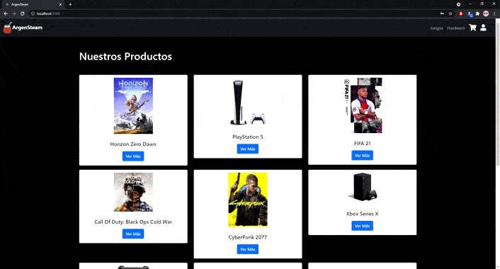

# ArgenSteam con React

## DESCRIPCIÓN
Proyecto realizado para el curso de React de Coderhouse.
Simulador de reserva de productos de Hardware o Videojuegos. El usuario para poder hacer la reserva de los productos que desea deberá crearse una cuenta en la aplicación y si lo desea puede cerrar su sesión. Puede ingresar mediante Google o crearse una cuenta. 

### Dependencias utilizadas
- React Router Dom
- Bootstrap
- Fontawesome
- SweatAlert 2
- Validator

### INSTALACIÓN
- Clona el código: `> git clone https://github.com/AyrDS/reactCoder.git`
- Corre la aplicación: `> npm start`

### DEMO
